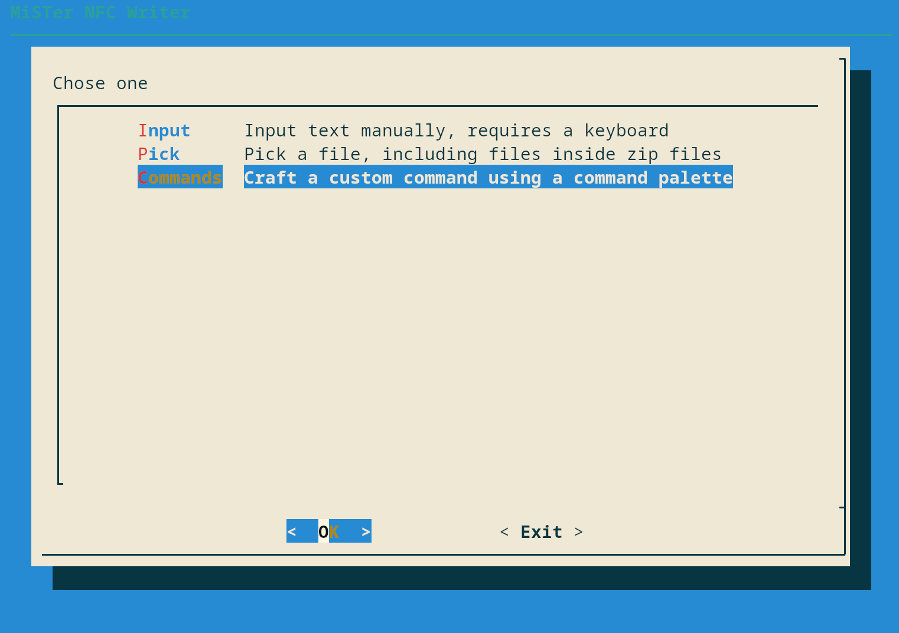

# MiSTer NFC Write

This is a tool to create NFC Tags by browsing and select games, crafting
commands using a command palette using a gamepad, or typing commands and URLs
directly in using a keyboard. All from the comfort of your MiSTer FPGA device.

This tool is intended to be upstreamed into [NFC script by Wizzo](https://github.com/wizzomafizzo/mrext/blob/main/docs/nfc.md)
when its ready for wide consumption.

Why use this tool? Well hopefully it will be included if you install
the nfc script by Wizzo, and it will be the easiest way to create NFC tags.
And doesn't require any more hardware than what you are already using to
launch games using NFC Tags. It should also let you avoid being prone to
copy paste mistakes and spelling mistakes.

## TODO

Not complete list of tasks to do

- [ ] Testing
- [ ] Vet the regex used to check validity of URLs
- [ ] All English language messages are subject to be reworded (All English language texts in the program so far is "programmer art")
- [ ] Writing the about page

## Status

### The logic to write to an NFC tag

Ready for testing by technical people

### Mappings database

Ready for testing by technical people

### The logic to read from an NFC tag

Ready for testing by technical people

### Browsing inside zip files

This is now more or less finished,
expect there to be some bugs, but currently it works.
Haven't tested it on huge libraries zipped.

### A commands pallate

Ready for testing by technical people

### New features

After wide testing starts, there might be use cases and features that needs
to be catered to.

When new features gets added to the nfc script, they might need a UI
